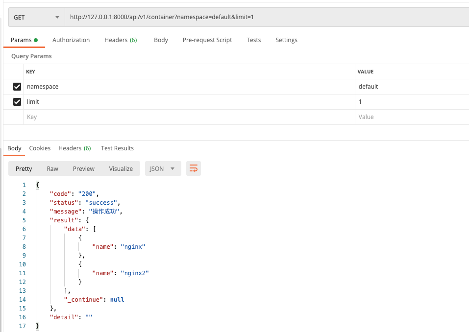

# 项目启动

## 安装python依赖

```python

pip install - i https://pypi.douban.com/simple -r requirements.txt

```

> python3.9.0

## 执行数据库脚本

## 启动

```python
python manage.py runserver
```

# 功能点

- 针对相关资源的crud，支持表格方式输入和yaml方式
- 支持pod的日志实时查询，以及exec交互
- 支持管理系统权限管理(非k8s级别)
- 支持系统操作审计，如操作审计，操作yaml审计历史操作追综。

# 接口展示

### 分页获取namespace列表


### 分页获取deployment列表


### 分页获取event列表


### 分页获取pod列表


### 获取pod下的container



### 获取deployment的yaml文件内容


### 获取pod的yaml文件内容


### 通过yaml文件部署资源对象


# todo

- 实现累日志模块功能，捕捉和输出所有容器的中断日志到efk中
- 实现基于prometheus+grafana的集群监控报警
- 接入 istio server mesh方式的流量监控和服务管理